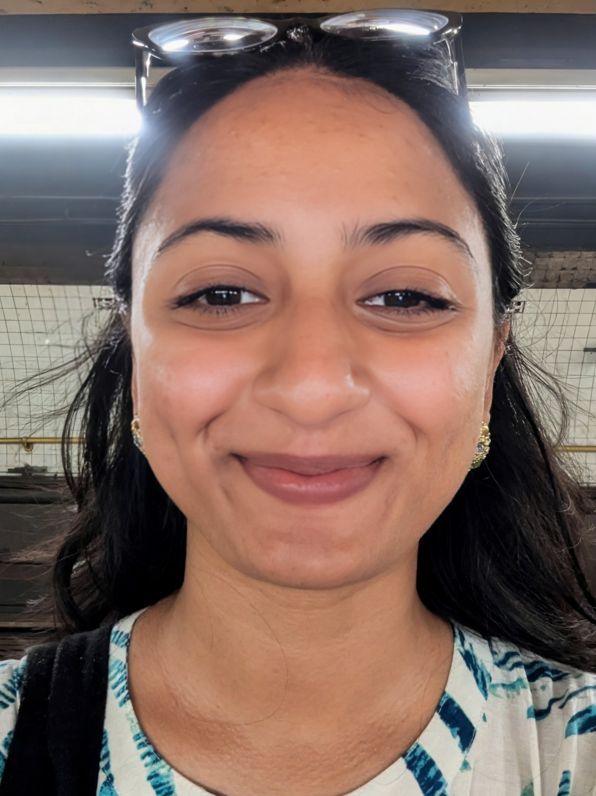

<html lang="en">
<head>
  <meta charset="utf-8" />
  <meta name="viewport" content="width=device-width,initial-scale=1" />
  <title>Rahma Simin Ali | Portfolio</title>
  <meta name="description" content="Rahma Simin Ali — Software Engineer & ML Researcher. Trustworthy ML, NLP/LLMs, IoT/CP systems, reliability-critical software." />

  
  
</head>

<body>
  <nav>
    

      <a href="#resume">Resume</a>
      <a href="https://drive.google.com/file/d/1SdIhpDa4FnJ6BOgNUMNbUEYbrG-uV7WT/view?usp=sharing"
       target="_blank"
       rel="noopener noreferrer">
      Resume (PDF)
    </a>
      <a href="#projects">Projects</a>
      <a href="#achievements">Achievements</a>
      <a href="#leadership">Leadership</a>
      <a href="#contact">Contact</a>
    

  </nav>

  <main>
    <!-- HERO / ABOUT -->
    <section id="about">
      

        <!-- Put your photo at /assets/profile.jpg (or change the path here) -->
        <!--  -->
         
         <!--  -->
        

          <h1>Rahma Simin Ali</h1>
          
<strong>Software Engineer</strong> &nbsp;|&nbsp; <strong>Machine Learning Researcher</strong>

          

            <a class="pill" href="https://github.com/" target="_blank" rel="noreferrer">GitHub</a>
            <a class="pill" href="https://www.linkedin.com/" target="_blank" rel="noreferrer">LinkedIn</a>
            <a class="pill" href="mailto:rahmasimin@gmail.com">Email</a>
            <a class="pill" href="https://scholar.google.com/citations?hl=en&user=ImxU8DIAAAAJ&view_op=list_works&gmla=AH8HC4xTYBp80ZfyN29QRG22c-0nV0l93Dp6bEVvQG1rcPDHGIj2HspUynis0qLdeHEVLN6Hx46Em5uB7c59RAqx" target="_blank" rel="noreferrer">Google Scholar</a>
          

          

            Trustworthy ML
            NLP / LLMs
            Low-Resource + Clinical NLP
            Software Engineering
            IoT / Cyber-Physical
            Reliability-Critical Systems
          

        

      

      <h2 style="margin-top:26px;">About me</h2>
      

        I’m <strong>Rahma Simin Ali</strong> (she/her), a Software Engineer and Machine Learning Researcher with over
        <strong>2 years of industry experience</strong> at CloudlyIO and Cloudly Infotech Limited.
      

      

        My work sits at the intersection of trustworthy machine learning, natural language processing,
        cyber-physical systems, and reliability-critical software engineering. Across research and industry,
        I focus on a single guiding question:
        <em>How can we build intelligent systems whose behavior, reasoning, and failures remain reliable under real-world constraints?</em>
      

      

        I am currently applying to <strong>PhD programs in Computer Science (Fall 2026)</strong>, with research interests centered on
        ML systems, LLM reasoning faithfulness, low-resource NLP, and dependable AI for safety-critical domains.
      

    </section>

    <!-- RESUME -->
    <section id="resume">
      <h2>My Resume</h2>

      

        <h3>Education</h3>
        
<strong>B.Sc. in Computer Science and Engineering</strong> — Chittagong University of Engineering and Technology (CUET)

        <ul>
          <li>GPA: <strong>3.74 / 4.00</strong> (Last 4 semesters: <strong>3.85</strong>)</li>
          <li>Merit Position: <strong>13th out of 126</strong></li>
          <li>Full merit-based undergraduate scholarship</li>
        </ul>
      

      

        <h3>Publications</h3>
        <ul>
          <li><strong>ReTSoSPA</strong> — IoT-based Real Time Soil Sensing for Precision Agriculture (IEEE ICCIT 2024)</li>
          <li><strong>Optimizing Complexity of Quick Sort</strong> (ICCSCS 2020, Springer)</li>
        </ul>
      

      

        <h3>Industry Experience</h3>
        <ul>
          <li><strong>Software Engineer</strong>, Cloudly Infotech Limited (2024–2025): correctness-critical backend systems; security; reliability</li>
          <li><strong>Software Engineer Intern</strong>, CloudlyIO (2023–2024): Rails, testing, background jobs, performance</li>
        </ul>
      

    </section>

    <!-- PROJECTS (with filter) -->
    <section id="projects">
      <h2>Projects</h2>
      
Filter by category to quickly skim.

      

        <button class="btn active" data-filter="all">All</button>
        <button class="btn" data-filter="ml">Machine Learning</button>
        <button class="btn" data-filter="systems">Systems</button>
        <button class="btn" data-filter="software">Software Development</button>
      

      

        <!-- ML -->
        

          <h3>LLM Fine-Tuning for Mathematical Reasoning Faithfulness</h3>
          

            Curated step-aligned hints + fine-tuned LLMs to reduce inconsistent intermediate steps; controlled evaluation beyond final answer accuracy.
          

          

            Machine Learning
            NLP / LLMs
            Trustworthy AI
          

        

        

          <h3>BanglaBERT for Alzheimer’s Detection</h3>
          

            Built a low-resource clinical NLP benchmark by adapting DementiaNet with controlled translation and biomarker-preserving validation.
          

          

            Clinical NLP
            Low-Resource
            Evaluation
          

        

        <!-- Systems / IoT -->
        

          <h3>ReTSoSPA / SoilSensingBD (IEEE ICCIT 2024)</h3>
          

            End-to-end cyber-physical pipeline (sensors → wireless → ESP32 → cloud); 3,918 measurements; XGBoost 99% crop prediction accuracy.
          

          

            IoT
            Cyber-Physical
            ML Systems
          

        

        <!-- Software -->
        

          <h3>JEXCA Alumni Platform (2,500+ users)</h3>
          

            Correctness-critical workflows (secure elections, payments, RBAC), fault tolerance, audit trails, and production incident response.
          

          

            Backend
            Reliability
            Security
          

        

        

          <h3>Attendance Automation (Biometric → HRM)</h3>
          

            Automated ETL pipeline integrating ZKTime fingerprint machine with Laravel HRM; reduced manual reconciliation; improved tamper resistance.
          

          

            Automation
            ETL
            Laravel
          

        

        

          <h3>CloudBox: Role-Driven File Collaboration (AWS S3)</h3>
          

            Secure multi-organization storage pipeline with strict permission enforcement and reliable access control.
          

          

            AWS S3
            Access Control
            Scalability
          

        

      

    </section>

    <!-- ACHIEVEMENTS -->
    <section id="achievements">
      <h2>Achievements</h2>
      <ul>
        <li>Merit Position: <strong>13th / 126</strong> (CUET)</li>
        <li>Full merit-based national undergraduate scholarship</li>
        <li>Appreciation Award for Outstanding Contribution — Cloudly (2025)</li>
        <li>Research Sub-Coordinator — CUET Computer Club</li>
        <li>National Girls’ Programming Contest participant (2019)</li>
      </ul>
    </section>

    <!-- LEADERSHIP -->
    <section id="leadership">
      <h2>Leadership</h2>
      <ul>
        <li>Organized coding competition with <strong>200+ participants</strong> at CUET CSE FEST</li>
        <li>Led seminars/workshops as Research Sub-Coordinator, CUET Computer Club</li>
        <li>Tutored math/science for school + undergraduate students</li>
        <li>Volunteer: Software Engineering best practices, IoT-based smart systems workshops</li>
      </ul>
    </section>

    <!-- CONTACT -->
    <section id="contact">
      <h2>Contact</h2>
      
If you are a faculty member or admissions committee member and would like to discuss my work, I’d be happy to connect.

      

        <strong>Email:</strong> <a href="mailto:rahmasimin@gmail.com">rahmasimin@gmail.com</a> 
        <strong>Website:</strong> <a href="https://upoma1998.github.io/rahmasimin.github.io/">rahma-simin.github.io</a>
      

    </section>

    <footer>
      ©  Rahma Simin Ali · Built with GitHub Pages
    </footer>
  </main>

  
</body>
</html>
